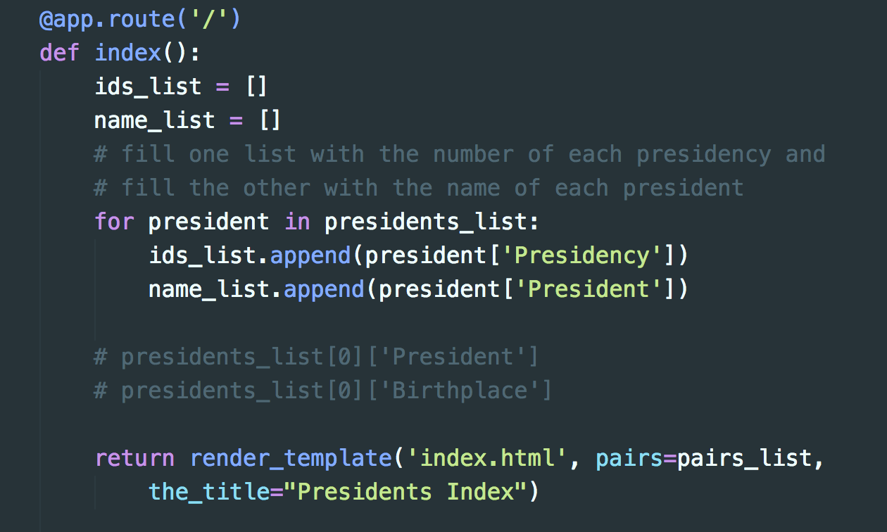
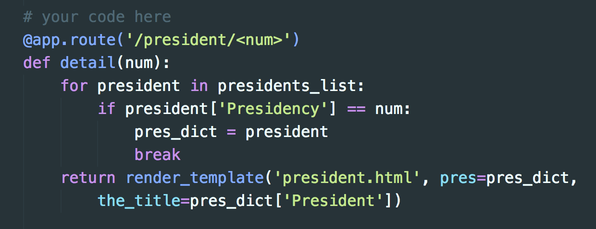

# A Flask exercise for beginners

**IMPORTANT NOTE TO MY STUDENTS:** This exercise and all of its code have been replaced. Please see the [Flask Templates chapter](https://python-adv-web-apps.readthedocs.io/en/latest/flask3.html#) in the **Python Beginners** resource.

## Get Started

In this exercise, we will work with a CSV file as our data source to create individual pages for each of the 45 United States presidents. The CSV file is provided for you: *presidents.csv* (Open it above.)

**1. DOWNLOAD THE ZIPPED VERSION OF THIS REPO to follow along in class.**

**2. UNZIP it and drag the folder flask-exercise-master into the folder that contains your virtualenv for Flask projects.**

**3. ACTIVATE your virtualenv.**

**4.** Our Flask app file is: *presidents.py* **Open it in Atom.**

[These instructions are on a slide to show in the classroom.](https://docs.google.com/presentation/d/1mu6lJXmbhUe_UioRYCmdknVzviKqU3TPbCk3bETQGm8/edit?usp=sharing)

A completed CSS file and 45 images have been provided in the *static* folder, which is where all such files (and JS files as well) must be for a Flask app to use them.

Three mostly completed Flask template files are in the *templates* folder, also required for a Flask app that uses templates.

**NOTE:** It is assumed you are in a Python 3.x virtual environment which has been **activated** and in which **Flask** has been installed.

## Contents

* [Convert a CSV file to a dictionary](#convert-a-csv-file-to-a-dictionary)
* [Test the dictionary list in a Flask route](#test-the-dictionary-list-in-a-flask-route)
* [Create a directory page (a list of links)](#create-a-directory-page-a-list-of-links)
   * [Examine the first template](#examine-the-first-template)
   * [Get the data needed for the directory page](#get-the-data-needed-for-the-directory-page)
   * [Revisit the first template](#revisit-the-first-template)
* [Create a detail page](#create-a-detail-page)
   * [The detail page template](#the-detail-page-template)
* [Relationships between routes, and templates, and links](#relationships-between-routes-and-templates-and-links)
* [Conclusion](#conclusion)

## Convert a CSV file to a dictionary

Our first task is to convert the CSV to a Python dictionary (or more accurately, a *list* of dictionaries).

A function to do this has already been written. It is in the *modules.py* file. It requires the built-in Python module `csv`. This script will work with *any* CSV file that has a header row.

```python
import csv

def convert_to_dict(filename):
    """
    Convert a CSV file to a list of Python dictionaries.
    """
    # open a CSV file - note - must have column headings in top row
    datafile = open(filename, newline='')

    # create list of OrderedDicts as of Python 3.6
    my_reader = csv.DictReader(datafile)

    # write it all out to a new list
    list_of_dicts = []
    for row in my_reader:
        # we convert each row to a string and add a newline
        list_of_dicts.append( dict(row) )

    # close original csv file
    datafile.close()
    # return the list
    return list_of_dicts
```

Instead of copying this function into our Flask app file, *presidents.py*, we will **import** it there.

**ACTION 1: Add this on line 2** in *presidents.py*:

```python
from modules import convert_to_dict
```

Note that now you can run `convert_to_dict()` by entering *any* CSV filename as the argument. The function returns a list of dictionaries. With *presidents.csv* as the argument, the function returns a list of 45 dictionaries.

**ACTION 2: Add this on line 5** in *presidents.py* ABOVE the route:

```python
presidents_list = convert_to_dict("presidents.csv")
```

It is convenient to have `presidents_list` as a global variable so that we can use it in all of our Flask routes.

This Python list, `presidents_list`, contains 45 dictionaries &mdash; one per president.

## Test the dictionary list in a Flask route

The Flask app (*presidents.py*) already has one simple route:

```python
@app.route('/')
def index():
    return '<h1>Welcome to the presidential Flask example!</h1>'
```

**ACTION 3:** In *presidents.py,* change the route function `index()` to:

```python
def index():
    heading = '<h1>Welcome to the presidential Flask example!</h1>'
    test1 = '<p>' + presidents_list[0]['President']
    test2 = ", born in " + presidents_list[0]['Birthplace'] + '.</p>'
    return heading + test1 + test2
```

We know that `listname[0]` will return the value of the **first item** in a Python list. In our list of dictionaries, `presidents_list`, each item is a complete dictionary of information about one U.S. president.

To access any item inside a dictionary, we use its **key**. Our keys in `presidents_list` include `'President'` and `'Birthplace'` (these key names came from the column headings in the CSV). We **cannot** access the dictionary with `presidents_list['President']` because &mdash; remember &mdash; `presidents_list` is a LIST. So we access one item in the list and *then* the key inside that item: `presidents_list[0]['President']`.

**ACTION 4:** Save the edited *presidents.py* file and run it in Terminal (first, make sure your virtualenv is *activated*):

```python
python presidents.py
```

That launches Flask's built-in local web server. In your web browser, type `localhost:5000/` in the address bar to launch the web server &mdash; you will see the result of `@app.route('/')` and its function, `index()`.

If your browser displayed "Welcome to the presidential Flask example!" and "George Washington, born in Westmoreland County, Virginia." &mdash; you have verified that you can access `presidents_list` from a route function. Review the function above to ensure you understand how it worked, because we're about to change it further.

You can view the CSV file (`presidents.csv`) as a lovely table here on GitHub and see all the presidential facts that are available to us from `presidents_list`, our list of dictionaries.

## Create a directory page (a list of links)

In our app, there will be two page types:

* First, a **directory page** or index, listing all presidents by name, in the order of their presidency. Each name will be a link that opens a president's detail page.
* Second, the **detail page.** This will have the same layout and information for each individual president.

We will change the existing Flask route (`index()`) to create the directory page.

**ACTION 5:** Our first change is to add a **template** to the `index()` function. We already import `render_template` at the top of our app script, so all that's needed is to **change the return statement,** which currently reads:

```python
return heading + test1 + test2
```

To this:

```python
return render_template('index.html', pairs=pairs_list, the_title="Presidents Index")
```

**How it works:** Now, instead of writing the variables `heading`, `test1` and `test2` directly into the browser window, Flask will get a template file named *index.html* and write *its contents* into the browser window. The `render_template` function here passes two **variables** to the template: `pairs` and `the_title`.

We have not created `pairs_list` in *presidents.py* yet, so we can't run this yet. It would throw an error ("NameError: name 'pairs_list' is not defined").

### Examine the first template

All Flask templates must be in the *templates* directory. Open the template named *index.html* and note the following within the HTML:

* The H1 element
* A P element
* A UL element
* One LI element inside the UL

The H1 and P elements have normal text in them. We can write anything in a template that we would write in any regular HTML file.

The UL element contains Jinja2 templating directives:

```html+jinja

...

```

Those two directives are the start and end of a Python for-loop. If this reminds you of PHP (written inside HTML) &mdash; yes, it's the same idea. Flask allows us to insert Jinja2 directives to run Python commands in a template file. (For other Jinja2 directives, [read the docs](http://jinja.pocoo.org/docs/2.10/templates/).)

**We will loop over** a list named `pairs`. Where is that list, and how did the template get access to it? We passed it to this template with `return render_template()`, covered above. We haven't yet written the code that creates `pairs_list`, but when we look at this for-loop, we can see **what the list must contain:**

```html+jinja

    <li><a href="/president/{{ pair[0] }}">{{ pair[1] }}</a></li>

```

The double curly braces will be filled differently each time the loop repeats.

What we're aiming for is a list of 45 presidents in which each line looks like this:

```html
<li><a href="/president/1">George Washington</a></li>
```

Each **pair** in the **list** needs to provide, first, the *number* of the presidency, and second, the *full name* of the president.

Let's return to the app file and write that into the route function.

### Get the data needed for the directory page

**ACTION 6:** In *presidents.py*, in the route function, **delete** old code so that you're left with only this:

```python
@app.route('/')
def index():
    # presidents_list[0]['President']
    # presidents_list[0]['Birthplace']

    return render_template('index.html', pairs=pairs_list, the_title="Presidents Index")
```

**Do not delete anything above or below the route function!**

We know we need two items (a pair!) of information for each president: the *number* of the presidency, and the *full name* of the president. Earlier, we got the name of the first president with `presidents_list[0]['President']`. We got his birthplace with `presidents_list[0]['Birthplace']`. We don't need his birthplace now, but we need to know which **key** to use to get the number of his presidency.

Look at the CSV file and see if you can find it.

.<br>
.<br>
.

It's the first column, labeled "Presidency," so the **key** in the dictionary will be `['Presidency']`. Case-sensitive!!

We need to get all the numbers and names for all the presidents. **Let's use a loop.** Let's put all the numbers in one list, `ids_list`, and all the names in another list, `name_list`.

```python
ids_list = []
name_list = []
# fill one list with the number of each presidency and
# fill the other with the name of each president
for president in presidents_list:
    ids_list.append(president['Presidency'])
    name_list.append(president['President'])
```

**WHERE does it go?** Immediately after the line `def index():` and ABOVE the `return` statement.

**ACTION 7:** Put the previous code into the correct place in *presidents.py*.



If you're asking:

   * Why `president['Presidency']` and `president['President']` &mdash;
   * instead of `presidents_list[0]['Presidency']` and `presidents_list[0]['President']`?

... you need to think about **what the loop does.** It take each president's dictionary ONE by ONE, as `president`, from the list (`presidents_list`).

Previously, we had no loop. We had to specify *which* president (list item 0). Now we don't, because we are looping over the *entire list.*

Now we have all the data we need for the directory page, but the *index.html* template must receive a list of pairs: `[(number, name),(number, name), ...]`. That will be our `pairs_list`.

Here's how we make that ONE list of pairs from TWO lists (using Python's built-in `zip()` function):

```python
pairs_list = zip(ids_list, name_list)
```

**ACTION 8:** ADD that one line ABOVE the `return` statement.

Because our CSV lists the presidents in order by their presidency, and we made a *list* of dictionaries from that CSV, we can be sure that they are in the order we want, starting at 1 and ending at 45. (If we needed to *sort* them, numerically or alphabetically, we would add another line of code in the function to do so. [Learn how to sort.](https://docs.python.org/3/howto/sorting.html))

The final route function:

```python
@app.route('/')
def index():
    ids_list = []
    name_list = []
    # fill one list with the number of each presidency and
    # fill the other with the name of each president
    for president in presidents_list:
        ids_list.append(president['Presidency'])
        name_list.append(president['President'])

    # zip() is a built-in function that combines lists
    # creating a new list of tuples
    pairs_list = zip(ids_list, name_list)

    return render_template('index.html', pairs=pairs_list, the_title="Presidents Index")
```

**ACTION 9:** SAVE the edited *presidents.py* file and RUN IT in Terminal with:

```python
python presidents.py
```

Or, if the server is still active in Terminal, just RELOAD the window you opened earlier.

**NOTE:** It is essential that you name the list `pairs_list`, because that's what the `return` statement specifically says will be passed to the template variable `pairs`.

### Revisit the first template

Although it's fairly plain, our directory page does have some CSS styles applied. It also has a title (visible in the browser tab). Open *index.html* in the *templates* folder and let's see how that got done.

```html+jinja



...

```

More Jinja2 directives! The first one tells Flask that *index.html* extends another template file, named *base.html*. The second and third directives surround the HTML content that is **inserted into** the HTML in *base.html*.

Open *base.html*. This is where we find the HEAD element, with the CSS file link, and the TITLE element. Note that the TITLE element is filled dynamically. **Question:** How was the correct text inserted here?

**Answer:** We sent the TITLE text to *base.html* via *index.html* with `return render_template()` in the route function in *presidents.py*:

```python
return render_template('index.html', pairs=pairs_list, the_title="Presidents Index")
```

Note carefully the way it is formatted in *base.html*:

```html+jinja
<title>{{ the_title }}</title>
```

Another thing to note in *base.html* is that these two directives EXACTLY match those in *index.html*:

```html+jinja


```

You could set up multiple blocks, in which case *additional* blocks would need to be labeled something *other than* **content.**

A final note about template files, for now, is that the double curly braces contain a placeholder that will be REPLACED by text, as we saw in *index.html*:

```html+jinja

    <li><a href="/president/{{ pair[0] }}">{{ pair[1] }}</a></li>

```

While we're there (*index.html*), note that we will need to edit that HREF value. Comment text on lines 9-16 in the file tells you what to do &mdash; but not yet. Later.

Some students asked why we have `pair[0]` and `pair[1]` above.

1. `pairs` is a **list** of tuples.
2. In the route function `index()`, we created `pairs_list` with the command: `pairs_list = zip(ids_list, name_list)`
3. `pairs_list` is a list of pairs, like this: `[ ('1', 'George Washington'), ('2', 'John Adams'), ('3', 'Thomas Jefferson'), ... ]`
4. We **passed** `pairs_list` to the template as the **value** of the variable `pairs` in the `return` statement at the end of the `index()` function.
5. We **loop over** the list, `pairs`, and from *each* pair we extract the first value, `pair[0]`, and the second value, `pair[1]`.

If you forgot what a tuple is, see "The Tuple Data Type" in [Sweigart's chapter 4](http://automatetheboringstuff.com/chapter4/).

## Create a detail page

As already noted, our app will have two page types:

* A **directory page** or index, listing all presidents by name, in the order of their presidency. We've finished that one.
* The **detail page.** This will have the same layout and information for each president.

**We don't have a route or function for the detail page yet.** Let's review what we needed for our *first* route and function:

* Its route is `'/'`
* Its function is `index()`
* It uses the template file *index.html*

**For a new route, we will need:**

1. A new route decorator with a new path (`/` *followed by* something)
2. A new function with a new name
3. A second template in the *templates/* folder

To create the detail pages, we must have a new route. The request to the web server must **match** the links we set up in our link list in the *index.html* template, because those links will open each detail page. To the browser, those links will look like this:

```html
<li><a href="/president/1">George Washington</a></li>
...
<li><a href="/president/44">Barack Obama</a></li>
```

Therefore, the server request must be `/president/` followed by a number, which will be *different for each president.*

Here's how we handle that in the route and function:

```python
@app.route('/president/<num>')
def detail(num):
    return render_template('president.html', pres=pres_dict, the_title=pres_dict['President'])
```

**ACTION 10:** INSERT that new route and function in *presidents.py*, BELOW the first route and function.

The function `detail()` will take the number from the server request (sent when the user clicks a link on our directory page) as an *argument,* `num`, which we can use *in the function* to find the entire dictionary for that president:

```python
for president in presidents_list:
    if president['Presidency'] == num:
        pres_dict = president
        break
```

Note that `break` makes the loop quit. Once we find the single president indicated by `num`, we don't need to loop anymore.

**ACTION 11:** INSERT that code ABOVE the `return` statement.

(Alternatively, we could use just `pres_dict = presidents_list[int(num)-1]`. It would work fine for *this* data source. However, many data sources will NOT have such a handy correlation between a unique ID *number* and the list order, and a goal here is to make code that's easy to adapt for other projects you might do.)

Your new route now looks like this:

```python
@app.route('/president/<num>')
def detail(num):
    for president in presidents_list:
        if president['Presidency'] == num:
            pres_dict = president
            break
    return render_template('president.html', pres=pres_dict, the_title=pres_dict['President'])
```

Now we have a completed `pres_dict`, which is all we need to pass to the *president.html* template &mdash; it contains *the entire dictionary* for ONE president. That's the same as one complete row from the CSV.

**Check your indents carefully,** and SAVE *presidents.py*.



### The detail page template

The new `detail()` function passes information to the *president.html* template file in the *templates folder*. Open that file, and you'll see that it uses the same *base.html* template used by our other template, *index.html*.

Note that both routes fill in the TITLE element in the HEAD in the same manner, and that this is in the *base.html* template.

There are 15 columns in the CSV file, so we have 15 details about each president. You can use these details in any format you like &mdash; a paragraph, a list, etc. Refer to the CSV for the EXACT **key** text to use in the template. **The image and the Wikipedia link have already been coded into the template, along with an H1 element.**

**ACTION 12:** You may save *president.py* and RELOAD IT now, before editing *president.html* &mdash; the *president.html* template will work even without the additional details.

## Relationships between routes, and templates, and links

We must be fussy and *precise* about the **paths** we write into Flask template files, or the URLs will not work. Here is a list of every URL or path in this exercise:

* To the CSS file: `href="{{ url_for('static', filename='css/main.css') }}"` (in *base.html*)
* To each detail page: `href="{{ url_for( 'detail', num=pair[0] ) }}"` (in *index.html*)
* To the directory page: `href="{{ url_for('index') }}"` (in *president.html*)
* To the image file for a given president: `src="{{ url_for('static', filename='images/'+pres['Image']) }}"` (in *president.html*; `pres` is the template variable for the dictionary, so to get the value from the *Image* key in `pres` we write `pres['Image']`; we concatenate the image filename to its folder name, *images/*, with a plus sign)
* To the Wikipedia page for a given president: `href="{{ pres['Wikipedia-entry'] }}"` (in *president.html*; `pres` is the template variable for the dictionary, so to get the value from the *Wikipedia-entry* key in `pres` we write `pres['Wikipedia-entry']`)

**This list reveals one remaining problem we have not solved:** The links in *index.html* are going to **break** on a live server if we do not use the Flask/Jinja2 function `url_for()` &mdash; this is necessary for ALL links that lead anywhere **inside** the Flask app. ONLY the Wikipedia link is exempt, as it leads to an *external* site. We will fix that now.

**ACTION 13:** Open the *index.html* template file and change this:

```html+jinja
<li><a href="/president/{{ pair[0] }}">{{ pair[1] }}</a></li>
```

To this:

```html+jinja
<li><a href="{{ url_for( 'detail', num=pair[0] ) }}">{{ pair[1] }}</a></li>
```

It's quite tricky when you're not used to it! **Note how the terms correlate to the function:**

```python
def detail(num):
```

That's the trick! It is NOT based on the `@app.route()` line but rather on the *definition of the route function.*

**ACTION 14:** SAVE and RELOAD in the browser. Check to make sure you can still open presidents' pages. If you get a `TemplateSyntaxError` in the browser, you've got an error in that HREF in the *index.html* template. In fact, any `jinja2.exceptions` error will be fixable there.

## Conclusion

In this exercise, you used **a normal CSV file** to create detail pages for each of the 45 United States presidents, as well as a directory page listing all the presidents and linking to all the detail pages.

It is also possible to use other data sources to generate pages with Flask, including various SQL and NoSQL databases ([see the docs](http://flask.pocoo.org/docs/1.0/patterns/)).

This CSV method is quite handy for smaller apps, as CSV files are easy for most people to work with and can be exported from any spreadsheet application.

The completed app is fully contained in the folder *final_app* in this repo. You can change into that directory in Terminal and run *presidents.py* in that folder to see the final result, or just [view a complete live version here](https://weimergeeks.com/flask_pres/).

.
